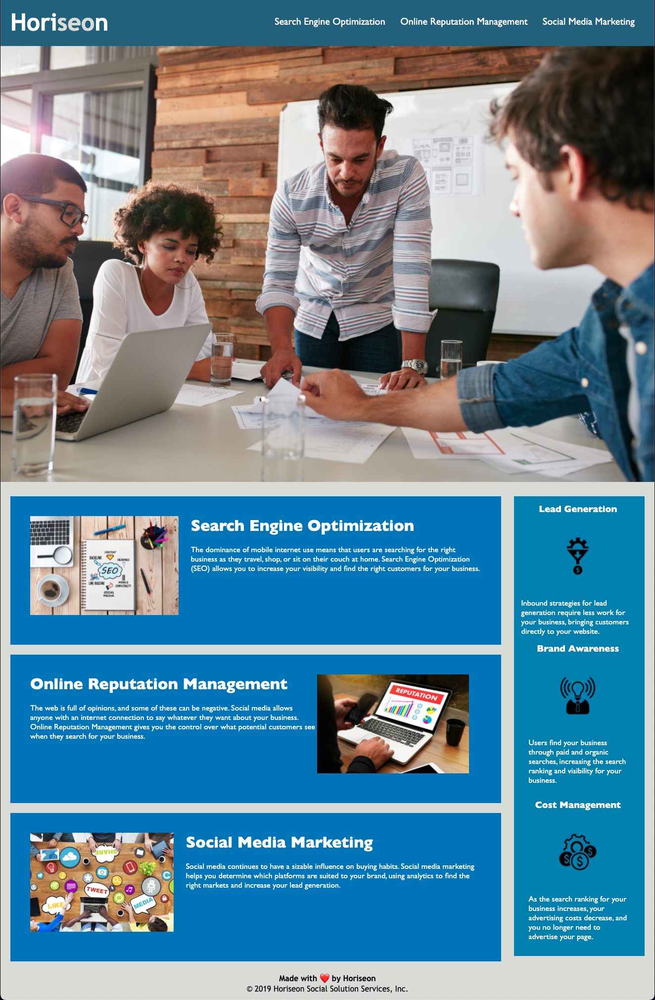

# Project 01 HTML, CSS, and Git: Code Refactor

## User Story

```
AS A marketing agency
I WANT a codebase that follows accessibility standards
SO THAT our own site is optimized for search engines
```


## Requirements / Acceptance Criteria

```
GIVEN a webpage meets accessibility standards
WHEN I view the source code
THEN I find semantic HTML elements
WHEN I view the structure of the HTML elements
THEN I find that the elements follow a logical structure independent of styling and positioning
WHEN I view the icon and image elements
THEN I find accessible alt attributes
WHEN I view the heading attributes
THEN they fall in sequential order
WHEN I view the title element
THEN I find a concise, descriptive title

```

### Change Log
* Refactored CSS
* Consolidated CSS Classes
* Changes Classes to id's as needed
* Connected Anchor Links in Main Nav
* Added more descriptive title
* Content follows a logical structure
* Checked for Accesibility
    * Added Alt Text for Images
    * No Hidden Images
    * Added role and description for heart icon
    * Structure for headings is in order
    * Changed colors for contrast accesibility
    * Added semantic elements
    * Links are in tab order
    * Links work
    * No Iframes
* Refactored CSS


### To Do
* Make the layout responsive.
* Reduce Image Sizes


## Mock-Up This is an image of my application.

The following image shows the web application's appearance and functionality:




---
